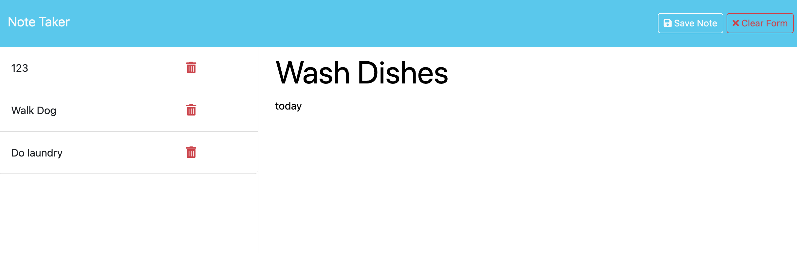

# Note Taker

## Description

Note Taker is a program to help with keeping track of your tasks. The user can enter their notes, click the save button to store the notes and also click the delete button to remove notes.

The motivation for this program is to help keep users organized. Creating this project I learned how to structure api calls to get, post, and delete notes.

## Table of Contents

- [Usage](#usage)
- [Credits](#credits)
- [License](#license)

## Usage

Deployed URl: https://ahgeak.github.io/note_taker/

GitHub Repo: https://github.com/ahgeak/note_taker 

Type a new note with a descrition. Then click the save note button to save the note to the database file and the note will be displayed on scren. You will also have the option to clear form. If you would like to open an old task, click on the name in the left column. To delete a task click the trash can icon next to that task.

Screenshot of project:

## Credits

I used documentation from the mdn website at: https://developer.mozilla.org/en-US/

I read forums on StackOverFlow at: https://stackoverflow.com/

I attended a tutoring session to discuss the api calls for this program.

## License

This project uses an MIT license.
